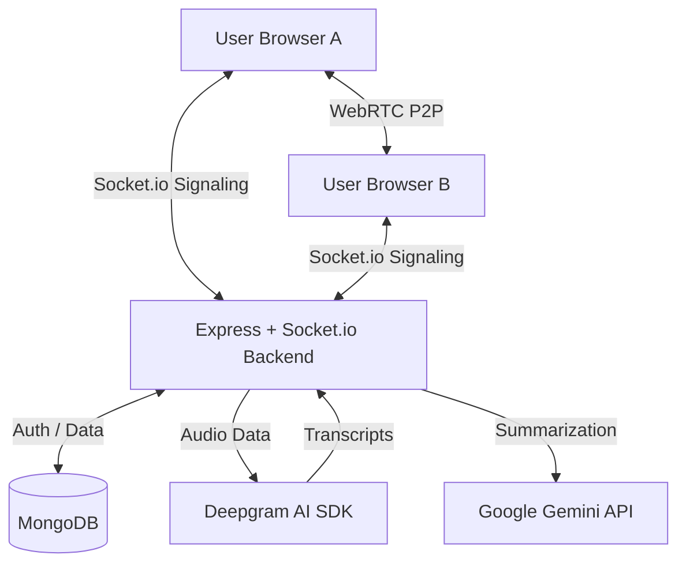

<h1 align="center">🎥 NexaMeet - Video Conferencing System</h1>

<p align="center">
  A premium, full-stack, real-time video conferencing application built with the <strong>MERN Stack</strong>, <strong>WebRTC</strong>, and <strong>AI Powered Features</strong>.
  <br />
  Connect, collaborate, and communicate — directly in your browser with real-time captions and AI-generated meeting summaries.
</p>

<p align="center">
  
  
  
  
  
  
  
  
  
</p>

---

## 📌 Table of Contents

- [Overview](#-overview)
- [Key Features](#-key-features)
- [Tech Stack](#-tech-stack)
- [Architecture Overview](#-architecture-overview)
- [Project Structure](#-project-structure)
- [Installation & Setup](#-installation--setup)
- [Environment Variables](#-environment-variables)
- [API Reference](#-api-reference)
- [How to Use](#-how-to-use)
- [NPM Scripts](#-npm-scripts)

---

## 🌐 Overview

**NexaMeet** is a feature-rich, browser-based video calling platform that enables users to host or join live video meetings instantly. Built on the MERN stack with WebRTC for peer-to-peer media streaming and Socket.io for real-time signaling. 
The application has been extensively refactored with a **Clean Architecture**, modern **Vite & Tailwind CSS** frontend, highly secure **OTP-based Authentication**, and advanced AI features including **Real-time Transcription via Deepgram** and **Meeting Summarization via Google Gemini API**.

---

## ✨ Key Features

| Feature                          | Description                                                                                                   |
| -------------------------------- | ------------------------------------------------------------------------------------------------------------- |
| 🎙️ **AI Real-Time Transcription** | Deepgram-powered captions that provide live, speaker-identified transcripts during meetings.                  |
| 🤖 **AI Meeting Summaries**       | Google Gemini API generates intelligent meeting summaries based on meeting transcripts.                       |
| 🔐 **OTP Authentication Flow**    | Stateless JWT-based authentication combined with secure Email OTP verification for account security.          |
| 🛠️ **Advanced Host Controls**     | The meeting creator (host) can kick users, mute all participants, stop all videos, or end the meeting for all. |
| 📜 **Persistent Transcripts**     | All meeting transcripts and summaries are automatically saved to MongoDB and can be reviewed in History.      |
| 🎨 **Tailwind CSS UI**            | Modern, fast, and fully responsive user interface rebuilt completely with Tailwind CSS.                       |
| 🚀 **Vite & Clean Architecture**  | Blazing fast frontend builds using Vite, coupled with a modular and scalable backend folder structure.        |

---

## 🛠️ Tech Stack

### Frontend

| Technology               | Purpose                                      |
| ------------------------ | -------------------------------------------- |
| **Vite**                 | Next-generation frontend tooling             |
| **React 18**             | Core UI framework                            |
| **Tailwind CSS v4**      | Utility-first styling                        |
| **React Router DOM v6**  | Client-side routing                          |
| **Socket.io-client**     | Real-time signaling and chat relay           |
| **WebRTC**               | Peer-to-peer media streaming                 |

### Backend

| Technology               | Purpose                                       |
| ------------------------ | --------------------------------------------- |
| **Node.js & Express**    | Scalable server-side infrastructure           |
| **Socket.io**            | WebSocket server for signaling & host sync    |
| **Deepgram SDK**         | AI-powered real-time audio analysis           |
| **Google Generative AI** | AI meeting summarization (Gemini 2.5 Flash)   |
| **MongoDB + Mongoose**   | Database for users, meetings, and transcripts |
| **Nodemailer**           | Email service for OTP delivery                |
| **bcrypt & JWT**         | Security, hashing, and token generation       |

---

## 🏗️ Architecture Overview



---

## 📁 Project Structure

```text
Video_conferencing_system/
├── backend/                    # Node.js Express Backend (Clean Architecture)
│   ├── src/
│   │   ├── app.js              # Entry point
│   │   ├── config/             # DB & Environment Configuration
│   │   ├── controllers/        # Request handlers (auth, user, meeting)
│   │   ├── middleware/         # Auth & validation
│   │   ├── models/             # Mongoose schemas (User, Meeting, Transcript)
│   │   ├── routes/             # API Routing definitions
│   │   ├── services/           # Socket & Email Services
│   │   └── utils/              # Helpers
│   ├── .env.example
│   └── package.json
│
└── frontend/                   # React Frontend (Vite)
    ├── src/
    │   ├── App.jsx             # Routing setup
    │   ├── pages/              # Main App Views
    │   │   ├── Dashboard.jsx       # Main meeting dashboard
    │   │   ├── VideoMeet.jsx       # WebRTC Video Room
    │   │   ├── authentication.jsx  # Multi-step OTP Login/Register
    │   │   ├── history.jsx         # User meeting history
    │   │   └── MeetingTranscript.jsx # AI view format
    │   ├── components/         # Reusable UI Elements
    │   ├── hooks/              # Custom React Hooks
    │   ├── contexts/           # Global Contexts (AuthContext)
    │   └── utils/              # API and helper functions
    ├── index.css               # Tailwind directives
    └── package.json
```

---

## 🚀 Installation & Setup

1. **Clone & Install Backend**:
   ```bash
   cd backend
   npm install
   ```

2. **Clone & Install Frontend**:
   ```bash
   cd frontend
   npm install
   ```

3. **Configure Environment Variables**:
   Update `backend/.env` based on the `.env.example` structure.

4. **Start Development Servers**:
   - Backend: `npm run dev` in `backend/`
   - Frontend: `npm run dev` in `frontend/`

---

## 🔐 Environment Variables

Create a `.env` file in the `backend/` directory:

```env
# Database
MONGODB_URI=your_mongodb_connection_string

# CORS
CORS_ORIGIN=http://localhost:5173

# Server Port
PORT=8000

# API Keys
DEEPGRAM_API_KEY=your_deepgram_api_key
GEMINI_API_KEY=your_google_gemini_api_key

# JWT Authorization
JWT_SECRET=your_super_secret_jwt_string_here
JWT_EXPIRES=7d

# Email / SMTP Setup for OTP Verification
EMAIL_HOST=smtp.gmail.com
EMAIL_PORT=587
EMAIL_SECURE=false
EMAIL_USER=your_email@gmail.com
EMAIL_PASS=your_app_password
```

---

## 📡 API Reference

| Method | Endpoint                    | Auth   | Description                               |
| ------ | --------------------------- | ------ | ----------------------------------------- |
| `POST` | `/api/auth/send-otp`        | No*    | Send OTP code to email (*Rate-limited)    |
| `POST` | `/api/auth/verify-otp`      | No*    | Verify OTP code (*Rate-limited)           |
| `POST` | `/api/auth/register`        | No*    | Register new user (*Rate-limited)         |
| `POST` | `/api/auth/login`           | No*    | Basic Email/Password Login                |
| `POST` | `/api/v1/users/add_to_activity`| ✅ Yes | Add participants/session to history       |
| `GET`  | `/api/v1/users/get_all_activity`| ✅ Yes | Retrieve meeting history                 |
| `POST` | `/api/summarize-meeting`    | No     | Invoke Gemini API for transcript summary  |

---

## 📖 How to Use

1. **Authenticate**: Complete the OTP-based registration or standard login to access the dashboard.
2. **Start a Session**: From the Dashboard, click "Start Meeting" to generate a secure code.
3. **Invite Others**: Share the code. The creator is designated as the **Host**.
4. **Toggle Captions**: Use the CC/Transcript button to begin AI live transcription via Deepgram.
5. **Manage Call**: The Host has access to additional controls preventing users from causing disruption.
6. **AI Summary & History**: View past meetings through the History page, which extracts full transcripts and processes Gemini-generated summaries.

---

## 📜 NPM Scripts

| Location | Command | Action |
| --- | --- | --- |
| Backend | `npm run dev` | Starts server with Nodemon |
| Backend | `npm start`   | Runs standard node deployment |
| Frontend | `npm run dev` | Launches Vite dev server |
| Frontend | `npm run build` | Compiles frontend for production |

---

## 🤝 Contributing

Contributions are welcome! Please follow these steps:

1. Fork the repository
2. Create a feature branch: `git checkout -b feature/your-feature-name`
3. Commit your changes: `git commit -m 'feat: add some feature'`
4. Push to the branch: `git push origin feature/your-feature-name`
5. Open a Pull Request

---

## 📄 License

This project is licensed under the **ISC License**.

---

<p align="center">Made with ❤️ using the MERN Stack, AI, & WebRTC</p>
