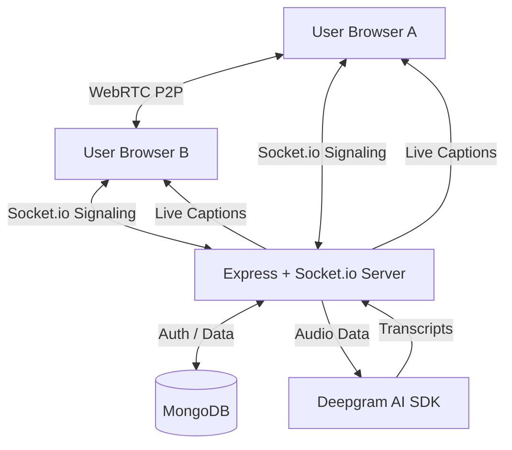

<h1 align="center">🎥 NexaMeet - Video Conferencing System</h1>

<p align="center">
  A premium, full-stack, real-time video conferencing application built with the <strong>MERN Stack</strong>, <strong>WebRTC</strong>, and <strong>AI Real-time Transcription</strong>.
  <br />
  Connect, collaborate, and communicate — directly in your browser with real-time captions.
</p>

<p align="center">
  
  
  
  
  
  
</p>

---

## 📌 Table of Contents

- [Overview](#-overview)
- [New Key Features](#-new-key-features)
- [Core Features](#-core-features)
- [Tech Stack](#-tech-stack)
- [Architecture Overview](#-architecture-overview)
- [Project Structure](#-project-structure)
- [Installation & Setup](#-installation--setup)
- [Environment Variables](#-environment-variables)
- [API Reference](#-api-reference)
- [How to Use](#-how-to-use)
- [NPM Scripts](#-npm-scripts)
- [Future Improvements](#-future-improvements)

---

## 🌐 Overview

**NexaMeet** is a feature-rich, browser-based video calling platform that enables users to host or join live video meetings instantly. Built on the MERN stack with WebRTC for peer-to-peer media streaming and Socket.io for real-time signaling, the application now includes AI-powered real-time transcription via Deepgram and advanced host controls.

---

## ✨ New Key Features

| Feature                          | Description                                                                                                   |
| -------------------------------- | ------------------------------------------------------------------------------------------------------------- |
| 🎙️ **AI Real-Time Transcription** | Deepgram-powered captions that provide live, speaker-identified transcripts during meetings.                  |
| 🛠️ **Advanced Host Controls**     | The meeting creator (host) can kick users, mute all participants, stop all videos, or end the meeting for all. |
| 📜 **Persistent Transcripts**     | All meeting transcripts are automatically saved to MongoDB and can be reviewed in the user's meeting history. |
| 🎨 **Premium Glassmorphism UI**  | Modern dark-themed interface with high-fidelity components, smooth animations, and a polished user experience. |
| 🛡️ **Enhanced Protection**        | Integrated rate-limiting for auth endpoints to prevent brute-force attacks.                                   |

---

## 🚀 Core Features

- 🎥 **Real-Time Video & Audio**: High-performance P2P video calling using WebRTC.
- 💬 **In-Meeting Chat**: Live messaging panel for seamless collaboration.
- 🔐 **Secure Authentication**: JWT-based login/registration with bcrypt hashing.
- 📋 **Meeting History**: A comprehensive log of past sessions, including participants and transcripts.
- 🎛️ **Media Controls**: Dynamic toggling of camera and microphone states.
- 📱 **Fully Responsive**: Optimized for desktops, tablets, and mobile browsers.

---

## 🛠️ Tech Stack

### Frontend

| Technology               | Purpose                                      |
| ------------------------ | -------------------------------------------- |
| **React 18**             | Core UI framework                           |
| **React Router DOM v6**  | Client-side routing                         |
| **Material UI (MUI) v5** | Component library for premium UI            |
| **Socket.io-client**     | Real-time signaling and chat relay          |
| **WebRTC**               | Peer-to-peer media streaming                |
| **Axios**                | REST API communication                      |

### Backend

| Technology               | Purpose                                       |
| ------------------------ | --------------------------------------------- |
| **Node.js & Express**    | Scalable server-side infrastructure           |
| **Socket.io**            | WebSocket server for signaling & host sync    |
| **Deepgram SDK**         | AI-powered real-time audio analysis           |
| **MongoDB + Mongoose**   | Database for users, meetings, and transcripts |
| **bcrypt & JWT**         | Industry-standard security and authentication  |
| **express-rate-limit**   | API request throttling and security           |

---

## 🏗️ Architecture Overview



---

## 📁 Project Structure

```text
Video_conferencing_system/
├── backend/                    # Node.js Backend
│   ├── src/
│   │   ├── app.js              # Entry point — Express & Socket.io
│   │   ├── controllers/
│   │   │   ├── user.controller.js    # Auth + history logic
│   │   │   └── socketManager.js      # WebRTC, Host Controls & Deepgram
│   │   ├── middleware/
│   │   │   └── auth.middleware.js    # JWT validation
│   │   ├── models/
│   │   │   ├── user.model.js         # User schema
│   │   │   ├── meeting.model.js      # Meeting history schema
│   │   │   └── transcript.model.js   # DB storage for transcripts
│   │   └── routes/
│   │       └── users.routes.js       # Auth & history API endpoints
│   ├── .env.example            # Env template
│   └── package.json            # Backend dependencies
│
└── frontend/                   # React Frontend
    ├── src/
    │   ├── App.js              # Routing and Global Styles
    │   ├── pages/
    │   │   ├── landing.jsx     # Marketing Landing Page
    │   │   ├── authentication.jsx  # Login/Register
    │   │   ├── home.jsx        # Dashboard (Join/Create)
    │   │   ├── VideoMeet.jsx   # Core Meeting Page
    │   │   └── history.jsx     # Session history with transcripts
    │   ├── components/
    │   │   ├── VideoGrid.jsx       # Adaptive video tile system
    │   │   ├── MeetingControls.jsx # Media toggles & Host controls
    │   │   ├── ChatPanel.jsx       # Real-time chat UI
    │   │   └── CaptionsOverlay.jsx # AI Transcription display
    │   ├── hooks/
    │   │   ├── useWebRTC.js        # WebRTC signaling logic
    │   │   └── useCaptions.js      # Audio capture & Socket relay
    │   └── contexts/
    │       └── AuthContext.jsx     # Global Authentication State
```

---

## 🚀 Installation & Setup

1. **Clone & Install Backend**:
   ```bash
   cd backend
   npm install
   ```

2. **Clone & Install Frontend**:
   ```bash
   cd frontend
   npm install
   ```

3. **Configure Environment Variables**:
   Update `backend/.env` (see below).

4. **Start Development Servers**:
   - Backend: `npm run dev` in `backend/`
   - Frontend: `npm run dev` in `frontend/`

---

## 🔐 Environment Variables

Create a `.env` file in the `backend/` directory:

```env
MONGODB_URI=your_mongodb_connection_string
CORS_ORIGIN=http://localhost:3000
PORT=8000
JWT_SECRET=your_jwt_signing_key
DEEPGRAM_API_KEY=your_deepgram_api_key
```

---

## 📡 API Reference

| Method | Endpoint                  | Auth   | Description                      |
| ------ | ------------------------- | ------ | -------------------------------- |
| `POST` | `/users/register`         | No*    | Register new user (*Rate-limited) |
| `POST` | `/users/login`            | No*    | Login and get JWT (*Rate-limited) |
| `POST` | `/users/add_to_activity`  | ✅ Yes | Log a session with participants  |
| `GET`  | `/users/get_all_activity` | ✅ Yes | Retrieve full meeting history    |

---

## 📖 How to Use

1. **Start a Session**: Log in and click "New Meeting" to generate a code.
2. **Invite Others**: Share the code. The first person to join is the **Host**.
3. **Toggle Captions**: Use the CC button to start AI transcription.
4. **Manage Call**: If you are the host, use the additional control buttons to manage participants.
5. **View History**: After leaving, go to the History page to see who was present and read the transcript.

---

## 📜 NPM Scripts

| Location | Command | Action |
| --- | --- | --- |
| Backend | `npm run dev` | Starts server with Nodemon |
| Frontend | `npm run dev` | Launches React dev server |
| Frontend | `npm run build` | Compiles for production |

---

## 🔮 Future Improvements

- [ ] **Virtual Backgrounds** — Background blur and custom virtual backgrounds
- [ ] **End-to-End Encryption** — Encrypt media streams for enhanced privacy
- [ ] **Reactions & Raise Hand** — Quick emoji reactions and a raise-hand feature

---

## 🤝 Contributing

Contributions are welcome! Please follow these steps:

1. Fork the repository
2. Create a feature branch: `git checkout -b feature/your-feature-name`
3. Commit your changes: `git commit -m 'feat: add some feature'`
4. Push to the branch: `git push origin feature/your-feature-name`
5. Open a Pull Request

---

## 📄 License

This project is licensed under the **ISC License**.

---

<p align="center">Made with ❤️ using the MERN Stack & WebRTC</p>
